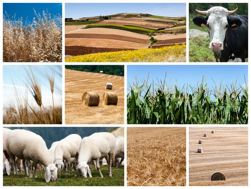

```{r setup, echo=FALSE, results='hide', message=FALSE, warning=FALSE}
knitr::opts_chunk$set(echo=FALSE, message=FALSE, warning=FALSE)

# Uvoz vseh potrebnih knjižnic
source("lib/libraries.r", encoding="UTF-8")
```

```{r rstudio, results='asis'}
# Izris povezave do RStudia na Binderju
source("lib/rstudio.r", encoding="UTF-8")
```

# Količine pridelanih kmetijskih pridelkov in število živine v Sloveniji

Izbrala sem si temo z naslovom Količine pridelanih kmetijskih pridelkov in število živine v Sloveniji. Prikazala bom, kako so se količine kmetijskih pridelkov spreminjale v časovnem obdobju od leta 2010 do 2019, količino posameznega pridelka v Sloveniji ter količina kmetijskih pridelkov po regijah. Prav tako bom prikazala število in vrsto živine po regijah in letih 2003, 2005, 2007, 2010, 2013, 2016. Podatke bom iskala na Statističnem uradu Republike Slovenija.



***

## Obdelava, uvoz in čiščenje podatkov

```{r uvoz}
source("uvoz/Uvoz1.r", encoding="UTF-8")
```

Uvozila sem podatke o količini kmetijskih pridelkoh po regijah v obliki CSV s statističnega urada.
Podatke imam v dveh razpredelnicah v obliki *tidy data*.

1. `kmetijska.kultura` - podatki o kmetijskih kulturah
  - `leto` - spremenljivka: leto od 2010 do 2019 (tip podatkov: 
                celo število)
  - `regija` - spremenljivka: slovenska regija (tip: niz)
  - `kolicina` - meritev: povprečna količina pridelanega  
        pridelka v t/ha v ustreznem letu in ustrezni regiji
          (tip :realno število)
  
2. `vrsta.zivine` - podatki o živini
  - `leto` - spremenljivka: leta  2003, 2005, 2007, 2010,
        2013,2016  (tip podatkov: celo število)
  - `regija` - spremenljivka: slovenska regija (tip: niz)
  - `stevilo` - meritev: stevilo  glav živine v danem letu in
        dani regiji   (tip: realno število)


**Opomba**:  da je 1. razpredelnica res v obliki *tidy data*, sem morala podati znak, ki označuje manjkajoče podatke("-"), imena regij in leta sem spravila v stolpec in nato preimenovala naslove stolpcev, ki so bili sestavljeni iz več besed. Leta sem pretvorila v cela števila.
V 2. razpredelnici sem podala znak, ki označuje manjkajoče podatke ('N', 'Z'), leta in števila živali sem spravila v stolpec in stolpce preimenovala. Leta sem pretvorila v cela števila.


***

## Analiza in vizualizacija podatkov
Pred analizo podatkov sem si zastavila naslednja vprašanja: \
- Katera kmetijska kultura in katera vrsta živine je bila  najbolj pogosta v Sloveniji \
- Kako je razvito kmetovanje s kmetijskimi pridelki in kako živinoreja po regijah \
- Kako se je spreminjala količina določenega kmetijskega pridelka in število določene vrste živine po letih v Sloveniji \
- Razlike v količinah kmetijskih pridelkov in vrste živine po regijah 

```{r vizualizacija, results='hide'}
source("vizualizacija/vizualizacija.r", encoding="UTF-8")
```

Spodnja grafa prikazujeta povprečje kmetijskih kultur (v t/ha) in živine (v številu glav), torej prikaže, katera kultura in katera vrsta živine je bila v povprečju najpogostejša v Sloveniji skozi vsa ta leta. 


```{r graf1, fig.align='center', echo = FALSE}
graf.povprecje.pridelkov.slovenija 
```

V tem grafu vidimo, da so v letih od 2010 do 2019 bile v Sloveniji najpogostejše kmetijske kulture silažna koruza, belo zelje, krompir, jabolka v intenzivnih sadovnjakih, breskve in nektarine, itd. 
\
\
```{r graf2, fig.align='center', echo = FALSE}
 graf.povprecje.zivine.slovenija
```

Ta graf nam pa prikaže, katera vrsta živine je bila najpogostejša v preučevanem obdobju, in sicer perutnina.
\
\

Spodnja zemljevida prikazujeta povprečno razvitost kmetovanja s kmetijskimi pridelki za vsako regijo in povprečno razvitost živinoreje za vsako regijo. 


```{r zemljevid1, echo=FALSE, message=FALSE, warning=FALSE, fig.align='center'}
zemljevid1
```


Vidimo, da je na gorenjskem povprečno največja pridelava kmetijskih pridelkov, kar nam lahko pojasni spodnji graf, na katerem vidimo, da so te kulture med bolj razvitimi na gorenjskem, še posebej belo zelje in krompir.
Tudi na osrednjeslovenskem je pridelava kmetijskih pridelkov močno razvita, prav tako sta najbolj zelje in krompir.
Na obalno-kraškem je pa takšna vrsta kmetijstva zelo slabo razvita zaradi nerodovitne zemlje. Največ pa pridelajo jabolk in silažne koruze.

```{r graf3, fig.align='center', echo = FALSE}
 graf.pridelki.regije
```
\

```{r zemljevid2,echo=FALSE, message=FALSE, warning=FALSE, fig.align='center'}
zemljevid2

```
V tem zemljevidu pa vidimo razvitost živinoreje po Sloveniji. Najbolj izstopa Podravska, kjer je najbolj razvita perutnina, in sicer ima povprečno kar 1,819,230.67 glav perutnine, kar nam tudi pokaže spodnji graf, v katerem vidimo, da perutnina najbolj izstopa. Grafa sem razdelila v 2 dela, ker je število konjev, koz in ovc močno manjše in je tako bolj pregledno.

```{r graf4, fig.align='center', echo = FALSE}
graf.zivina.regije2
graf.zivina.regije1

```

Zanimalo me je še, kje so posamezni kmetijski pridelki povprečno najbolj razviti, oziroma kakšne so razlike v količinah kmetijskih pridelkov in vrste živine po regijah. To je prikazano v zgornjih dveh grafih. Prikazala sem za najpogostejše pridelke. Enako me je zanimalo tudi za vsako vrsto živine.

\
\


***

## Napredna analiza podatkov

```{r analiza}
source("analiza/analiza.r", encoding="UTF-8")
```
V tej fazi me je zanimalo, kakšna je predvidena količina kmetijskih pridelkov in število živine v prihodnosti. Naredila sem napoved do leta 2025.
v naslednjem grafu črne pike prikazujejo dejanske količine pridelkov v Sloveniji, rdeče pa napoved količin, na podlagi danih podatkov.
```{r graf7, echo=FALSE, fig.align='center'}
graf_napoved1
```
Naslednji graf prikazuje napoved živine v prihodnjih letih do 2025. Črne pike prav tako prikazujejo dejanske podatke o živini, rdeče pa napoved.
```{r graf8, echo=FALSE, fig.align='center'}
graf_napoved2
```


***
V Spodnjih grafih je pa prikazano spreminjanje količine kmetijskih pridelkov ter število živali po letih v posamezni regiji. 
Naredila sem tudi interaktivni tabeli povprečnega števila kmetijskih pridelkov in živine po regijah, v kateri  
so prikazani podobni podatki, kot v grafu 'Graf pridelkov po regijah' in 'Graf živine po regijah' , le da je tukaj prikazano za vse kmetijske kulture in ne le najbolj pogoste. Prav tako so podani natančni podatki, kar pa iz grafov ni razvidno. 

```{r shiny}
shinyAppDir("shiny", options=list(width="100%", height=600))
```
